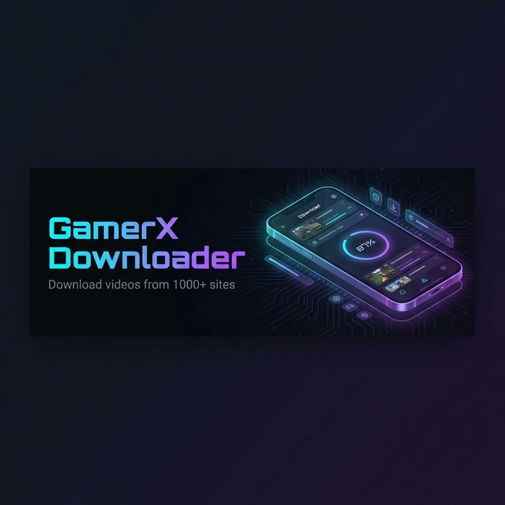
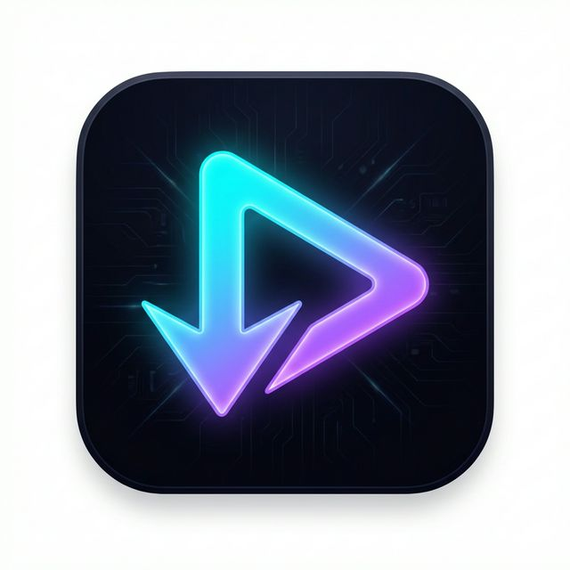

<p align="center">
  
</p>

<p align="center">
  
</p>

<h1 align="center">GamerX Downloader</h1>

<p align="center">
  <strong>A powerful, feature-rich video & audio downloader for Android</strong>
</p>

<p align="center">
  <a href="https://github.com/GamerX3560/GamerX-Youtube-Downloader/releases/latest">
    
  </a>
  
  
  
</p>

<p align="center">
  <a href="#-features">Features</a> •
  <a href="#-screenshots">Screenshots</a> •
  <a href="#-download">Download</a> •
  <a href="#-tech-stack">Tech Stack</a> •
  <a href="#-building">Building</a> •
  <a href="#-contributing">Contributing</a>
</p>

---

## ✨ Features

### 🎯 Core
- **1000+ Supported Sites** — YouTube, Instagram, Twitter/X, TikTok, Reddit, Facebook, and [many more](https://github.com/yt-dlp/yt-dlp/blob/master/supportedsites.md)
- **Video & Audio Downloads** — Choose between video (MP4/MKV/WebM) or audio-only (MP3/M4A/OPUS/WAV)
- **Format Selection** — Browse ALL available formats with resolution, codec, FPS, file size details
- **Playlist Support** — Detect and batch-download entire playlists
- **Background Downloads** — Downloads continue even when the app is closed
- **Share Integration** — Share any URL from your browser directly to GamerX

### 🎨 Design
- **6 Stunning Themes** — Dark, AMOLED Black, Light, Midnight Blue, Ocean, Follow System
- **Material You (M3)** — Modern Material 3 design with Jetpack Compose
- **Real-time Progress** — Weighted progress bar with stage tracking (Fetching → Downloading Video → Downloading Audio → Merging → Saving)
- **Smooth Animations** — Shimmer loading, tab transitions, and micro-interactions

### ⚙️ Advanced
- **yt-dlp Auto-Update** — Automatically stays on the latest yt-dlp version
- **SponsorBlock** — Skip sponsored segments in YouTube videos
- **Cookie Import** — Import browser cookies for age-restricted or private content
- **Download History** — Full history with search and re-download capability
- **Custom Filename Templates** — Configure output filenames with yt-dlp templates
- **Custom Download Directory** — Save to any location on your device
- **FFmpeg Bundled** — Full FFmpeg + aria2c integration for format merging and faster downloads

---

## 📸 Screenshots

> *Coming soon — Screenshots will be added after the first stable release*

---

## 📥 Download

### Latest Release
Download the latest APK from the [**Releases**](https://github.com/GamerX3560/GamerX-Youtube-Downloader/releases/latest) page.

| Variant | Description |
|---|---|
| `app-universal-debug.apk` | Works on all devices (recommended) |
| `app-arm64-v8a-debug.apk` | Modern 64-bit ARM devices |
| `app-armeabi-v7a-debug.apk` | Older 32-bit ARM devices |
| `app-x86_64-debug.apk` | x86_64 emulators / ChromeOS |

### Requirements
- Android 7.0 (API 24) or higher
- ~80 MB storage for app + yt-dlp + FFmpeg

---

## 🛠️ Tech Stack

| Layer | Technology |
|---|---|
| **Language** | Kotlin |
| **UI Framework** | Jetpack Compose (Material 3) |
| **Architecture** | MVVM + Repository Pattern |
| **DI** | Hilt (Dagger) |
| **Database** | Room |
| **Networking** | OkHttp 4 |
| **Image Loading** | Coil |
| **Background Work** | WorkManager |
| **Download Engine** | [yt-dlp](https://github.com/yt-dlp/yt-dlp) via [youtubedl-android](https://github.com/JunkFood02/youtubedl-android) |
| **Media Processing** | FFmpeg (bundled) |
| **Accelerated Downloads** | aria2c (bundled) |
| **Preferences** | DataStore |
| **Navigation** | Navigation Compose |
| **Pagination** | Paging 3 |

---

## 🏗️ Project Structure

```
app/src/main/java/com/gamerx/downloader/
├── GamerXApp.kt                 # Application class (yt-dlp + ffmpeg init)
├── MainActivity.kt              # Main entry point + permissions
├── data/
│   ├── db/                      # Room database, DAOs, entities
│   ├── model/                   # Data models (VideoInfo, FormatInfo, etc.)
│   └── repository/              # Download & Settings repositories
├── di/                          # Hilt dependency injection modules
├── download/
│   ├── DownloadWorker.kt        # WorkManager worker with weighted progress
│   └── YtDlpManager.kt         # yt-dlp command builder & executor
└── ui/
    ├── components/              # Reusable UI components
    ├── downloads/               # Active/Queued/Completed download screens
    ├── history/                 # Download history screen
    ├── home/                    # Home screen with URL input
    ├── more/                    # Settings screen
    ├── share/                   # Share intent handler (format selection)
    └── theme/                   # Theme system (Color.kt, Theme.kt, Type.kt)
```

---

## 🔨 Building

### Prerequisites
- Android Studio Hedgehog (2023.1.1) or later
- JDK 17
- Android SDK 34

### Steps

```bash
# Clone the repository
git clone https://github.com/GamerX3560/GamerX-Youtube-Downloader.git
cd GamerX-Youtube-Downloader

# Build debug APK
./gradlew assembleDebug

# The APK will be at:
# app/build/outputs/apk/debug/app-universal-debug.apk
```

### Build Variants

| Variant | Command |
|---|---|
| Debug (all ABIs) | `./gradlew assembleDebug` |
| Release (signed) | `./gradlew assembleRelease` |
| Specific ABI | `./gradlew assembleDebug -Pabi=arm64-v8a` |

---

## 🤝 Contributing

Contributions are welcome! Please read [CONTRIBUTING.md](CONTRIBUTING.md) for guidelines.

1. Fork the repository
2. Create your feature branch (`git checkout -b feature/amazing-feature`)
3. Commit your changes (`git commit -m 'Add amazing feature'`)
4. Push to the branch (`git push origin feature/amazing-feature`)
5. Open a Pull Request

---

## 📄 License

This project is licensed under the GPL-3.0 License — see the [LICENSE](LICENSE) file for details.

---

## 🙏 Acknowledgements

- [yt-dlp](https://github.com/yt-dlp/yt-dlp) — The backbone download engine
- [youtubedl-android](https://github.com/JunkFood02/youtubedl-android) — Android bindings for yt-dlp
- [FFmpeg](https://ffmpeg.org/) — Media processing and format merging
- [aria2](https://github.com/aria2/aria2) — Multi-connection download acceleration

---

<p align="center">
  Made with ❤️ by <a href="https://github.com/GamerX3560">GamerX</a>
</p>

<p align="center">
  <sub>⭐ Star this repo if you find it useful!</sub>
</p>
